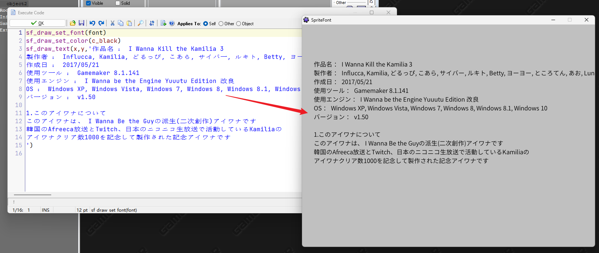
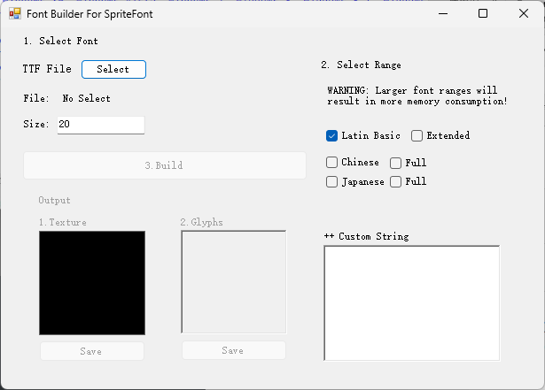
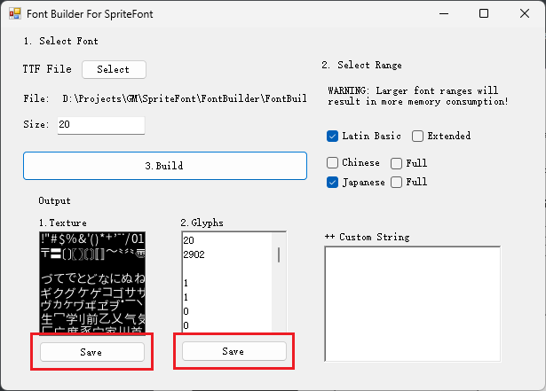
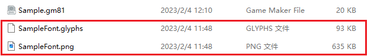
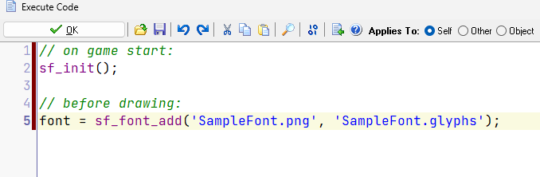
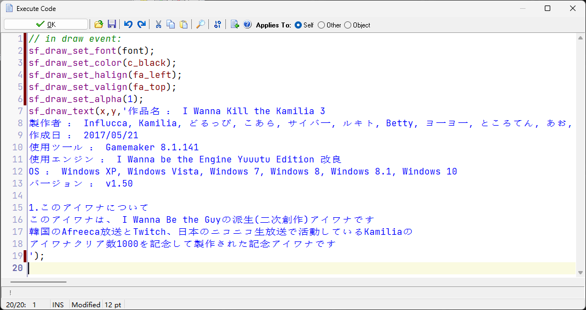

# SpriteFont for GM8.X

SpriteFont is some scripts for GM8.X to draw non-English text.

## Why

GM8.X currently does not support non-English text drawing. Although there is a nice text drawing extension called FoxWrting (https://github.com/Noisyfox/FoxWriting), it only supports GM8.0 and has some compatibility issues.

## Use

### 1. Build Font

SpriteFont is essentially a large sprite and some glyph information. So you have to convert .ttf to them first. Open FontBuilder.exe:

First **select a TTF file**, then set its **size** (text height), then select the **text range** you want on the right, and finally click **Build**, the tool will automatically generate Sprite images and glyph information. 

Then you need to click the "Save" button below them to save both the generated image and glyph information to a .png file and a .glyphs file.

### 2. Draw Font

Open your GM8 project, then import SpriteFont.gml (you can drag and drop), call **sf_init()** once when the game starts, then use **sf_font_add()** to load the font, and finally use **sf_draw_text()** to draw the text.

